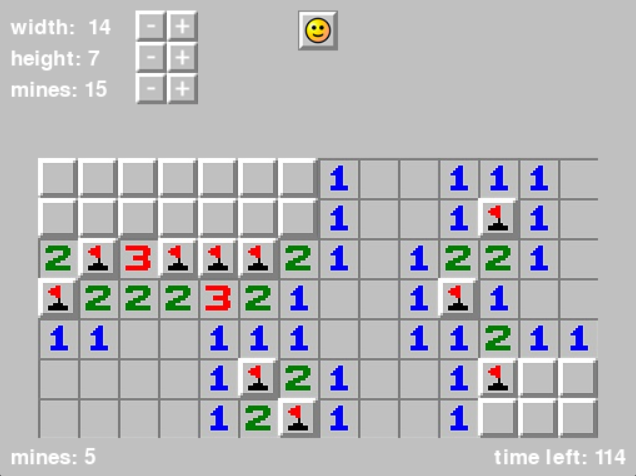

# Minesweeper Game

This project implements the classic Minesweeper game using Python and the Pygame library. It features a customizable grid size, mines placement, and an interactive interface.

## Table of Contents

- [Features](#features)
- [Getting Started](#getting-started)
- [Game Controls](#game-controls)
- [Screenshots](#screenshots)
- [Dependencies](#dependencies)
- [How to Run](#how-to-run)
- [Customization](#customization)
- [Contributing](#contributing)
- [License](#license)

## Features

- Customizable grid size and number of mines.
- User-friendly interface with clickable cells.
- Timer and bomb counter to track game progress.
- Adjustable parameters for width, height, and mines using buttons.
- Game over messages for winning or losing conditions.

## Getting Started

To play the Minesweeper game, ensure you have Python and Pygame installed on your system. Follow the instructions in the [How to Run](#how-to-run) section to start the game.

## Game Controls

- Left-click on a cell to reveal it.
- Right-click on a cell to flag or unflag it.
- Left-click on the smiley face to restart the game.

## Screenshots



## Dependencies

- Python 3.x
- Pygame library

## How to Run

1. Clone the repository to your local machine.
   ```bash
   git clone https://github.com/uclaudiu7/minesweeper.git

2. Navigate to the project directory.
    ```bash
    cd minesweeper

3. Run the Minesweeper game.
    ```bash
    python minesweeper.py
    ```

## Customization
Adjust game parameters and cell images by modifying the configs.py file. Customize the Minesweeper grid generation in the board.py module.

## Contributing
Contributions are welcome! Feel free to open issues or submit pull requests.
